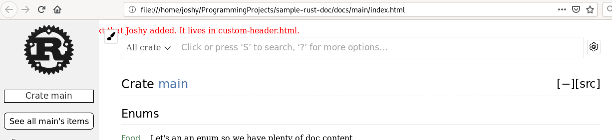

This is just a playground to try out rustdoc's --html-before-content flag. It works, but is pretty primitive.

# Rendered result

# Reproduce the results
1. clone this repo
2. `rustdoc src/main.rs --html-before-content custom-header.html -o docs`
3. open `docs/main/index.html` in your browser.

# Problems
1. Don't know how to use this flag with `cargo doc` just with `rustdoc` directly.
2. Doesn't look that nice anyway. CSS could probably fix that.
